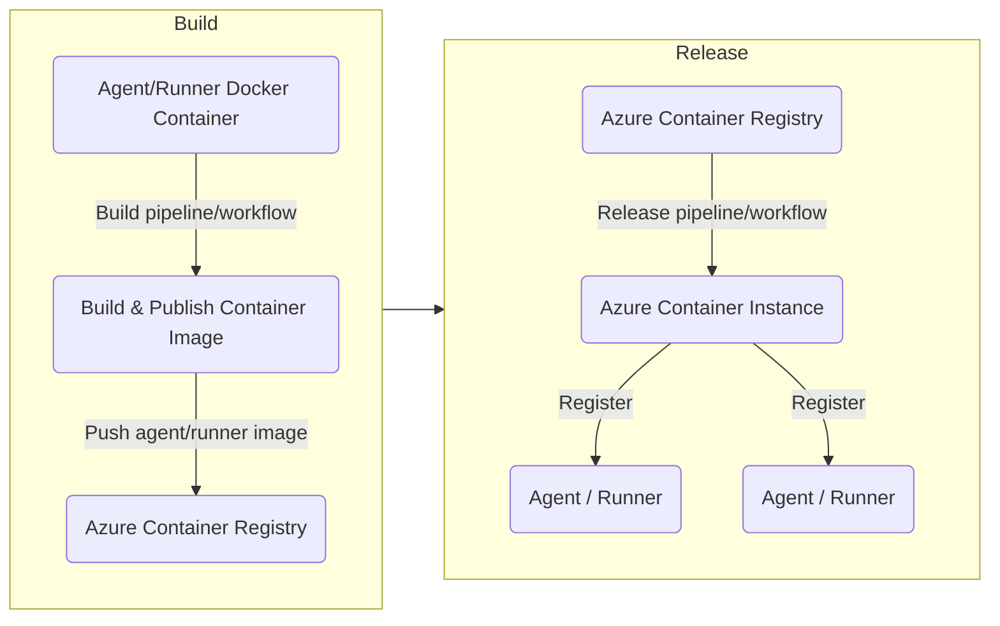

# Overview

This project provides a complete solution for creating and deploying a self-hosted agent/runner for Azure DevOps and Github using Docker containers. The solution supports automated deployment using bicep to Azure cloud where the agent/runner is hosted. The Docker container provides high portability and the ability to easily move agents across different environments.

- [Agent Docker Container](#agent-docker-container)
- [Introduction](#introduction)
- [Azure DevOps Pipelines](#azure-devops-pipelines)
- [Github Actions](#github-actions)
- [Virtual Network](#virtual-network)
- [Contributing](#contributing)
- [License](#license)

## Agent Docker Container

### ADO Pipelines Agent Linux Container

Read [ado-agent-linux/README.md](ado-agent-linux/README.md) for more.

### Github Actions Runner Linux Container

Read [github-runner-linux/README.md](github-runner-linux/README.md) for more.

## Introduction

**Build**

The first step to create a hosted agent is to build the docker image which contains the agent and all the required tools, then push the image to Azure Container Registry (ACR).

**Release**

The second step is to create an Azure Container Instance (ACI) and use the agent Docker image created in the previous step. The necessary environment variables should be passed to the container instance. This will create and run a container that hosts the agent.



## Azure DevOps Pipelines
### Pre-requisites
#### Service Connection
To deploy azure resources you need an Azure Resource Manager service connection.

You need to have the right permission to be able to create a service connection.

- In Azure DevOps, open the Service connections page from the project settings page.
- Click Create service connection and select Azure Resource Manager then click Next.
- Select Service principal (automatic), then click Next.
- Specify Scope level, Subscription, Resource group and Service connection name then click Save.

#### Agent pool
An agent pool is a collection of agents. When the pipeline runs, it runs on one of the agents from the specified agent pool.

To create a new agent pool:
- In Azure DevOps, open the Agent pools page from the project settings page.
- Click Add pool.
- Select New pool to link.
- Select Self-hosted from the pool type menu.
- Specify name, then click Create.

#### Personal Access Token (PAT)
A personal access token (PAT) contains your security credentials for Azure DevOps. It will be used by the self-hosted agent to authenticate into Azure DevOps.

To create a new PAT:
- From your home page, open user settings  and select Personal access tokens.
- Select + New Token.
- Specify a name, select the organization where you want to use the token, and then set the expiration.
- Select the following **scopes**:
    - Agent Pools (Read & manage)
    - Deployment Groups (Read & manage)
- Copy the token and store it in a secure location as it won't be shown again.

### Configure pipelines
#### Create Build pipeline
Create build pipeline using an exisitng yaml file and select [.azuredevops/pipelines/build.yml](.azuredevops/pipelines/build.yml) file.

**Required Environment Variables**
- `ENV_AZURE_CONNECTION` The name of the azure service connection
- `ENV_AZURE_RG` The name of the resource group.
- `ENV_ACR_NAME` The name of the azure container registry.

#### Create Deploy pipeline
Create build pipeline using an exisitng yaml file and select [.azuredevops/pipelines/release.yml](.azuredevops/pipelines/release.yml) file.

**Required Environment Variables**
- `ENV_AZURE_CONNECTION` The name of the azure service connection
- `ENV_AZURE_RG` The name of the resource group.
- `ENV_ACR_NAME` The name of the azure container registry.
- `ENV_AZP_LNX_POOL` The name of the Azure DevOps agent pool to deploy the self-hosted agents to.
- `ENV_AZP_PAT` Azure DevOps personal access token with the right permissions to allow the self-hosted agent to connect to Azure DevOps.
- `ENV_LNX_ACI_NAME` The name of the Azure Container Instance to deploy the self-hosted agent image to.
- `ENV_SUBNET_ID` The subnet resource Id for the container instance.

#### Run Build pipeline
Run the build pipeline and when it is completed go to Azure portal and verify that the ACR is created and the agent image is published.

#### Run Release pipeline
Run the deploy pipeline and when it is completed go to the agent pool and verify that the agents are created and online.

## Github Actions
### Pre-requisites

#### Azure Service Principal
To deploy azure resources you need a service principal with sufficient permissions on the target Azure Subscription or Resource Group. Then, generate a secret and be sure to copy the token and store it in a secure location, as it cannot be viewed again later.

#### Personal Access Token (PAT)
A personal access token (PAT) contains your security credentials for Github. It will be used by the self-hosted runner to call Github API to generate a self-hosted runner's registration token. 

To create a new PAT:
- Log in to your GitHub account.
- In the top-right corner of the screen, click on your profile photo and select "Settings".
- In the left sidebar, select "Developer settings".
- Click on "Personal access tokens" then select "Fine-grained tokens".
- Click the "Generate new token" button.
- Give your token a descriptive name to help you remember its purpose.
- Select the desired permissions for the token:
    - Read and Write next to "Administration".
- Click the "Generate token" button at the bottom of the page.

Your new token will appear on the screen. Be sure to copy the token and store it in a secure location, as it cannot be viewed again later.

#### Secrets and variables
The following secrets and variables are required by the Github actions workflows:

**Secrets**
- `ENV_AZURE_CREDENTIALS` Azure credentials to authenticate with Azure. Paste the following JSON into the secret's value field:
```
{
    "clientId": "<sp_client_id>",
    "clientSecret": "<sp_client_secret>",
    "subscriptionId": "<azure_subscription_id>",
    "tenantId": "<azure_tenant_id>"
}
```
Replace <azure_subscription_id> with the subscription ID, <azure_tenant_id> with the tenant ID, <sp_client_id> and <sp_client_secret> with the service principal Client ID and Client Secret generated from the previous step.
- `ENV_GITHUB_TOKEN`: Github personal access token generated from the previous step.

**Variables**
- `ENV_AZURE_RG` The name of the resource group.
- `ENV_ACR_NAME` The name of the azure container registry.
- `ENV_LNX_ACI_NAME` The name of the Azure Container Instance to deploy the self-hosted runner image to.
- `ENV_SUBNET_ID` The subnet resource Id for the container instance.


#### Run Build workflow
Run the "Build Actions Runner" workflow and when it is completed go to Azure portal and verify that the ACR is created and the agent image is published.

#### Run Release workflow
Run the "Deploy Actions Runner workflow" and when it is completed go to the repository settings then Actions then Runners and verify that the runners are created.

## Virtual Network
Running self-hosted agents/runners inside a VNet allows pipelines jobs to access private resources inside the VNet. This can be particularly useful when deploying applications that require access to private databases, file shares, or other resources that are only accessible from within the VNet. By running the agents/runners inside the VNet, you can ensure that the pipeline jobs have access to these resources without exposing them to the public internet.

To allow running Azure Container Instances (ACI) inside a VNet, you need to create a subnet specifically for the ACI. The subnet must be delegated to Azure Container Instances, which allows Azure to manage the underlying infrastructure for the ACI. To delegate the subnet, you need to configure the subnet properties to enable the "Microsoft.ContainerInstance/containerGroups" delegation. Once the delegation is enabled, you can pass the ACI subnet resource id to the [infrastructure/aci/main.bicep](infrastructure/aci/main.bicep) `subnetResourceId` parameter and run the release pipeline/workflow.

**Note** Once an Azure Container Instance (ACI) is deployed into a subnet, you cannot change the subnet associated with it. This means that if you need to move an ACI to a different subnet, you will need to delete and redeploy the ACI in the new subnet.

## Contributing

If you'd like to contribute to this repository, please create a pull request with your proposed changes. Be sure to include a detailed description of what your changes accomplish and any testing you've done to ensure the scripts continue to work as expected.

## License

This code is licensed under the MIT license. Please see the `LICENSE` file for more information.